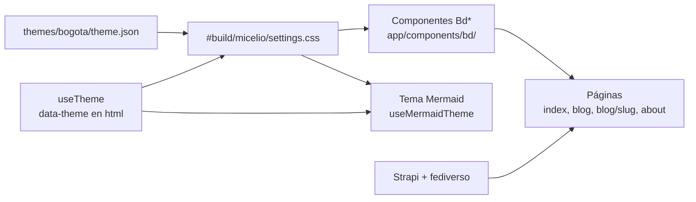
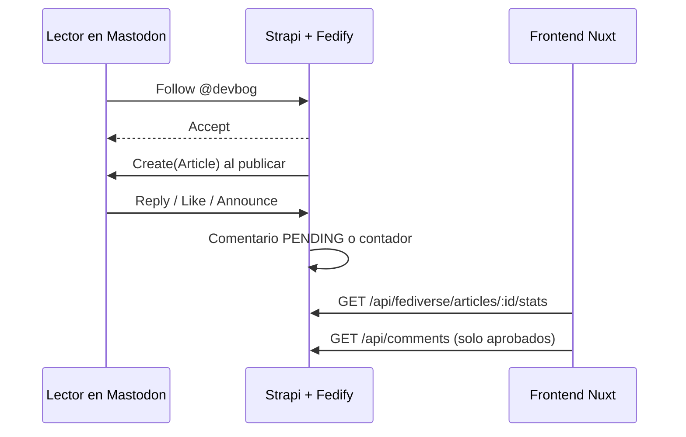
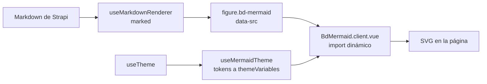
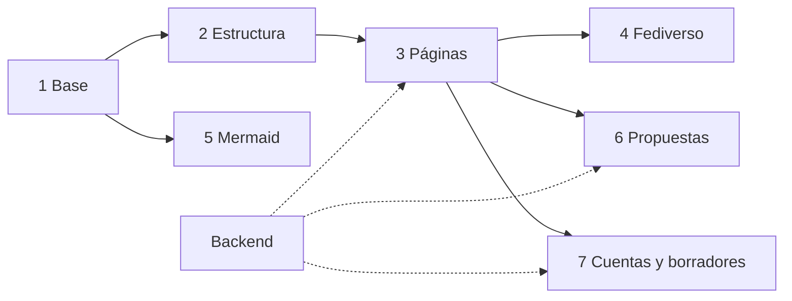
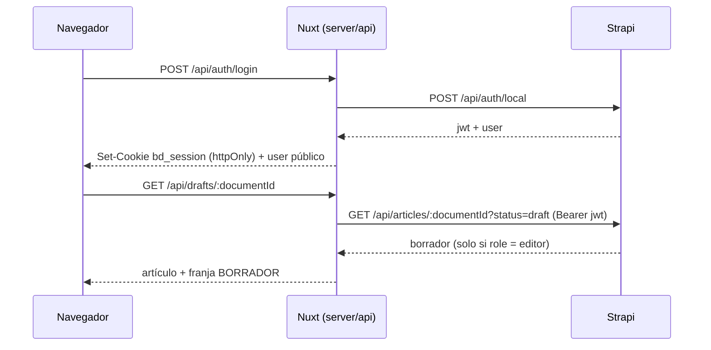

# BogDev — especificación de implementación del rediseño

> Rediseño «noche de páramo, aves de la sabana». Este archivo es la fuente de verdad para los agentes que implementan los issues etiquetados `rediseño`. Si un issue y este archivo difieren, manda el issue más reciente; si el lienzo y este archivo difieren en medidas u orden, manda el lienzo (`reference/canvas/`).

## 0. Cómo usar esta carpeta

| Archivo | Qué es | Cómo se usa |
| --- | --- | --- |
| `DESIGN.md` | Esta especificación | Leer completa la sección que cita tu issue, más las secciones 1 y 3 |
| `themes/bogota/theme.json` | Tokens del sistema de diseño (colores por modo, tipo, espacio, radios, sombras), antes `tokens.json` | Única fuente de valores. Nunca escribir un hex a mano. El build genera el CSS (`modules/theme`); `npm run tokens` lo imprime |
| `reference/canvas/*.dc.html` | Fuente HTML de cada pantalla del lienzo de diseño | Leer como especificación: estilos en línea = medidas, textos literales = copy final. **No copiar el markup**: es un prototipo con plantillas `{{…}}`, `<sc-if>`, `<sc-for>` y `<dc-import>` |
| `reference/canvas/bogdev-site.css` | Hoja compartida del lienzo (bandada, parallax, hoja inferior, acordeones, etc.) | Referencia de animaciones y keyframes |
| `assets/` | Fotos del hero (PNN Sumapaz, versiones Día y Noche) y el script que las prepara | Ya en `themes/bogota/images/hero/` |
| `reference/ds/bundle.js`, `bundle.css`, `index.d.ts.txt` | Componentes React del sistema de diseño | Referencia de props, clases `bd-*` y comportamiento para portarlos a Vue |

Pantallas del lienzo:

| Archivo | Pantalla |
| --- | --- |
| `Main.dc.html` | Inicio · escritorio (1440 px) |
| `Articulo.dc.html` | Artículo · escritorio |
| `Blog.dc.html` | Blog · escritorio |
| `Acerca.dc.html` | Acerca de · escritorio |
| `Movil.dc.html` | Inicio · móvil (390 px) |
| `BlogMovil.dc.html` | Blog · móvil |
| `AcercaMovil.dc.html` | Acerca de · móvil |
| `Header.dc.html` | Header · componente compartido (props `movil`, `activa`, `lectura`, `progreso`, `seccion`) |
| `Footer.dc.html` | Footer · componente compartido (prop `movil`) |

> Nota: las pantallas anteriores a esta versión muestran algunos textos de ejemplo entre corchetes (`[N]`, `[AQUÍ PUEDE IR TU FOTO]`). Son marcadores: el dato real sale de la API.

## 1. Resumen y convenciones

Cada requisito lleva un estado: **EXISTE** (ya está en producción, solo cambia la presentación), **NUEVO** (funcionalidad nueva) o **PROPUESTA APROBADA** (idea marcada ▲ en el lienzo; todas fueron aprobadas por Alejandro el 2026-09-24 y se construyen en la fase 6).

| Fuente | Qué contiene |
| --- | --- |
| Lienzo de diseño | 17 pantallas (incluye Privacidad escritorio y móvil y el Aviso): Inicio, Artículo, Blog, Acerca de, Cuenta, Borradores y Borrador de artículo (escritorio), Inicio, Blog, Acerca de, Cuenta y Borradores (móvil), Header y Footer compartidos |
| Sistema de diseño BogDev | Tokens y 8 componentes React (Logo, Button, CategoryTag, NavBar, PostCard, NewsletterForm, CodeBlock, Callout); logos oficiales |
| Frontend `bogd3v/micelio` | Nuxt 4, Vue 3, plain CSS, i18n es/en, Vitest, Playwright |
| Backend `bogd3v/micelio-cms` | Strapi 5, plugin de comentarios, plugin de fediverso (Fedify), `docs/FEDIVERSE.md` |

Convenciones para agentes:

- Seguir `AGENTS.md` del repo (script setup ordenado, tipos explícitos, sin comentarios, i18n para todo texto visible).
- Los componentes del sistema de diseño están en React; el frontend es Vue. Se portan a componentes Vue con el mismo nombre (`Bd*`), las mismas props y las mismas clases CSS `bd-*`. No montar React dentro de Nuxt.
- Colores, tipo y espacio salen de `theme.json` vía variables CSS. Nunca un hex en un componente.
- Textos: español de Colombia, tuteo, títulos en tipo oración, sin emoji ni signos de exclamación. Glifos permitidos: → ↗ ◆ ▲ ✕ ✓ ·. Cada texto nuevo va en `i18n/locales/es.json` y `en.json`.
- Un issue = un PR pequeño. Si el issue depende de otro abierto, trabajar sobre `main` con lo que exista y dejar la integración detrás de una bandera o un dato opcional; nunca inventar campos de API.

## 2. Estado actual frente al objetivo

| Área | Hoy en producción | Objetivo | Estado |
| --- | --- | --- | --- |
| Tema visual | Tailwind + Nuxt UI, claro/oscuro genérico (`useColorMode`) | Temas Noche y Día · Salmona con tokens BogDev | NUEVO |
| Logo | `themes/bogota/images/bogdev.svg` en header y footer | Componente `BdLogo`: color en Día, blanco en Noche | EXISTE (cambia uso) |
| Categorías | IA, Software, Linux | + Privacidad y DIY como pilares, cada una con su ave | NUEVO (requiere backend) |
| Header | `LayoutHeader` + `MobileMenu` lateral | `BdHeader` compartido (escritorio, móvil, lectura) + tab bar + hoja inferior | NUEVO |
| Inicio | Hero, destacado, últimos, newsletter | Hero con bandada, guía de campo, sección fediverso | NUEVO |
| Blog | Filtro por categoría y etiqueta, paginación de 6, barra lateral | Rediseño + bitácora, orden, ruta de lectura, marca leído, RSS por categoría | EXISTE + PROPUESTA APROBADA |
| Artículo | TOC, relacionados, Buy Me a Coffee, comentarios, compartir | Barra de lectura con ave, portada con diagrama, barra del fediverso, hilo unificado | EXISTE + NUEVO |
| Acerca de | Single type `about` con bloques | Ficha de campo tipo portafolio | NUEVO (requiere backend) |
| Fediverso | Backend listo (fases 0–4), sin UI | Seguir, contadores, respuestas como comentarios | NUEVO |
| Diagramas Mermaid | Sin soporte | Render con tema Noche/Día | NUEVO |
| Búsqueda | Modal, solo títulos, mínimo 3 letras | Paleta ⌘K + búsqueda en el contenido | EXISTE + PROPUESTA APROBADA |
| Móvil | Menú lateral | Barra superior, tab bar inferior y menú en hoja inferior | NUEVO |

## 3. Fundamentos visuales

Todo color sale de variables CSS con el nombre del token. El tema se aplica con `data-theme="noche"` o `data-theme="dia"` en `<html>`. Noche es el tema por defecto; sin preferencia guardada se respeta `prefers-color-scheme`.

### Colores por tema

| Token | Noche | Día · Salmona | Uso |
| --- | --- | --- | --- |
| surface | #0a0c10 | #f3e9df | Fondo de página |
| surface-raised | #12151b | #fbf6f0 | Tarjetas, menús, campos |
| surface-sunken | #06070a | #e8d8c8 | Código, imágenes vacías, diagramas |
| line / line-strong | #262a33 / #6c7380 | #dccab9 / #8f6f5d | Hairlines / borde de controles |
| ink / ink-muted | #f2f1ec / #9ba1ac | #2b1a13 / #6a4f42 | Texto |
| mirla | #ff7a1a | #a3410f | Marca, botón accent, Software |
| chillon | #2ee6b6 | #0a6656 | Enlaces, foco, éxito, IA |
| monjita | #ffd21f | #6f5200 | Aviso, Linux |
| pinchaflor | #a08cff | #4f36c2 | Privacidad (solo categoría) |
| golondrina | #5cb8ff | #0b5a9c | DIY (solo categoría) |
| tingua | #ff5a4e | #a21d2c | Solo errores |
| logo-agua / logo-ladrillo | #ffffff / #ffffff | #0D6B6F / #D4743F | Solo el logo |

Cada acento tiene su `*-soft` para fondos detrás de su propio texto. Un solo acento dominante por vista; el color nunca comunica solo (siempre palabra o glifo). Valores completos en `theme.json`.

Categorías y aves:

| Slug | Nombre | Ave | Token |
| --- | --- | --- | --- |
| privacidad | Privacidad | Pinchaflor (Diglossa cyanea) | pinchaflor |
| diy | DIY · Hazlo tú mismo | Golondrina (Pygochelidon cyanoleuca) | golondrina |
| ia | Inteligencia artificial | Colibrí chillón (Colibri coruscans) | chillon |
| software | Desarrollo de software | Mirla patinaranja (Turdus fuscater) | mirla |
| linux | Linux y código abierto | Monjita bogotana (Chrysomus icterocephalus bogotensis) | monjita |

### Tipografía, espacio y forma

- Archivo variable (ejes `wdth` 62–125 y `wght` 100–900) para todo; títulos grandes con `font-stretch: 125%` (clase `bd-wide`) y peso 300. JetBrains Mono para eyebrow, meta y código.
- Escala: display-xl 72/76, display-l 48/54, heading-1 32/40, heading-2 24/32, heading-3 19/26, body-l 19/32, body 16/26, body-s 14/22, eyebrow 12/16 (mayúsculas, tracking .16em), meta 13/20.
- Espacio base 4 px; secciones separadas 96 px en escritorio y 80 px en móvil; márgenes laterales 120 px (contenedor 1200 px) y 20 px en móvil.
- Esquinas rectas en todo (radio 0; 2 px solo en puntos de categoría; 9999 px solo en el avatar). Sin sombras de elevación: la profundidad es luz (`glow-chillon`, `glow-mirla`), reducida a hairline en Día.

### Movimiento y accesibilidad

- Transiciones de 240 ms con `cubic-bezier(.2, 0, 0, 1)`. Con `prefers-reduced-motion: reduce` no hay ninguna animación (bandada, parallax, barra de lectura, barrido de tema).
- Contraste mínimo 4.5:1 para texto y 3:1 para bordes de controles en ambos temas (verificado en los tokens).
- Foco visible: contorno de 2 px `var(--focus)` con 2 px de separación. Objetivos táctiles de al menos 44 px.

## 4. Arquitectura en el frontend (Nuxt 4)

El rediseño vive en una capa de tokens y componentes `Bd*` sobre la app actual; páginas, rutas, i18n y llamadas a Strapi se conservan.



### Base

- **Tokens.** `modules/theme` genera el CSS de roles en el build desde `themes/bogota/theme.json` (antes `tokens.json`). Mapear las variables actuales de `main.css` (`--foreground`, `--primary`, `--muted`, `--border`, `--surface-elevated`…) y la paleta de Nuxt UI a estas variables para no duplicar colores.
- **Tema.** Hoy `useTheme` envuelve `useColorMode` con valores light/dark. Configurar color mode con `dataValue: 'theme'` y mapear `dark → noche`, `light → dia`, o ampliar `useTheme` para exponer `tema: 'noche' | 'dia'`, `setTema()`, `toggle()`. La preferencia persiste y se aplica antes del primer pintado (sin parpadeo).
- **Cambio de tema con View Transitions.** `document.startViewTransition` con barrido circular desde el botón (`--vt-x`, `--vt-y`; keyframe `bd-wipe` en `bogdev-site.css`). Sin soporte o con movimiento reducido, cambio directo.
- **Fuentes.** Archivo (ejes wdth, wght) y JetBrains Mono autoalojadas en `themes/bogota/fonts/` (servidas en `/fonts/`) (preferible por privacidad) con `font-display: swap`.
- **Componentes** Vue en `app/components/bd/`: `BdLogo`, `BdButton`, `BdCategoryTag`, `BdNavBar`, `BdHeader`, `BdPostCard`, `BdNewsletterForm`, `BdCodeBlock`, `BdCallout`, `BdFooter`, `BdMermaid`. Props iguales a `reference/ds/index.d.ts.txt`.
- **Logo.** `BdLogo` dibuja los trazos exactos de `themes/bogota/images/bogdev.svg` (ver `LOGO` en `reference/ds/bundle.js`, `viewBox="10 70 506 386"`) con `fill: var(--logo-agua)` y `var(--logo-ladrillo)`; props `size`, `variant` (`auto | color | blanco | negro`) y `wordmark`.

### CSS moderno requerido

| Técnica | Dónde | Respaldo sin soporte |
| --- | --- | --- |
| View Transitions API | Cambio de tema y navegación (`experimental.viewTransition`) | Cambio instantáneo |
| Scroll-driven animations (`view()`, `scroll()`) | Revelado de secciones, barra de lectura, parallax del footer | Sin animación, estado final visible |
| CSS Motion Path + animación de `d` | Bandada del hero | Aves estáticas u ocultas |
| Container queries | `BdNewsletterForm` apila campo y botón por debajo de 440 px | — |
| `color-mix()` | Capas de los cerros del footer | Colores fijos por tema |
| Fuente variable (`font-stretch`) | Hover de títulos y marca | Sin cambio |
| `text-wrap: balance / pretty` | Títulos y párrafos | Ajuste normal |

Todas las animaciones de scroll van dentro de `@supports (animation-timeline: view())`.

## 5. Especificación por página

### 5.1 Header compartido (`Header.dc.html`)

Un solo componente `BdHeader` en `layouts/default.vue`, reemplaza `LayoutHeader`, `LayoutMobileMenu` y `LayoutReadingProgress`. Props:

| Prop | Tipo | Uso |
| --- | --- | --- |
| `activa` | `'inicio' \| 'blog' \| 'acerca'` | Marca el enlace actual (`aria-current="page"`, subrayado mirla). Derivar de la ruta |
| `lectura` | `boolean` | En `/blog/[slug]` cambia la franja HUD por la franja de lectura |
| `seccion` | `string` | Categoría del artículo en las migas |

Eventos: `search` (abre la paleta ⌘K), `menu` (abre la hoja inferior en móvil). Tema e idioma los resuelve el propio header con `useTheme` y `useI18n`.

- **Escritorio** (≥ 768 px): `BdNavBar` de 72 px (logo 30 px + «BogDev», Inicio · Blog · Acerca de, selector ES/EN) y debajo una franja de 64 px:
  - Variante sitio: `◆ BOGOTÁ 4.61°N 74.08°W 2.640 M S.N.M.` a la izquierda; chip `◆ @devbog` (enlace a la sección fediverso del inicio), botón `Buscar ⌘K` y segmento `Noche | Día` a la derecha.
  - Variante lectura: barra de progreso de 2 px en chillon con un ave aleteando en la punta (`animation-timeline: scroll(root)`), migas `INICIO / BLOG / <categoría>`, `LEÍDO N %` y segmento `Noche | Día`.
- **Móvil** (< 768 px): barra de 64 px fija con `position: sticky`: logo 28 px + marca, botón Buscar y botón Menú (iconos de trazo, `aria-label`).
- **Tab bar inferior** (móvil, parte del layout): fija, 64 px, Inicio · Blog · Buscar · Menú; pestaña activa con borde superior mirla.
- **Hoja inferior** (móvil): `<dialog>` modal con secciones, los 5 temas con su punto de color, tema de color Noche/Día e idioma ES/EN. Esc y deslizar cierran; el `<dialog>` modal deja inerte el resto de la página.
- **Paleta de búsqueda** (`SearchModal.vue` rediseñado): resultados de artículos y temas, acciones «Cambiar tema» y «Seguir en el fediverso». Atajo ⌘K / Ctrl+K (`useKeyboardShortcut` ya existe).

### 5.2 Inicio (`Main.dc.html`, `Movil.dc.html`)

- Hero: «Explorando privacidad, DIY, IA, software y Linux.» en display-xl ancho; a la derecha, una foto real del Parque Nacional Natural Sumapaz (laguna, frailejonal y cerro) en dos versiones (`assets/sumapaz-foto-dia.jpg`, natural y cálida; `assets/sumapaz-foto-noche.jpg`, etalonada a luz de luna con cielo estrellado), 1520 × 1440, generadas con `assets/sumapaz_foto.py` desde la foto original. La imagen se funde hacia `surface` por la izquierda, arriba y abajo para no competir con el titular. Encima, 3 rutas de vuelo con 9 aves en `offset-path` que aletean animando `d` y la etiqueta «PNN SUMAPAZ · FRAILEJONES». Se cambia de imagen con el tema (`.bd-noche .bd-img-dia, .bd-dia .bd-img-noche { display: none }`); en producción usar `<picture>`/`NuxtImg` con AVIF/WebP, `alt=""` (decorativa) y `fetchpriority="high"`. **Crédito obligatorio (CC BY-SA 4.0):** foto «Paisaje Sumapaz, Colombia» de Danielfjio en Wikimedia Commons. El pie de figura muestra «FOTO: DANIELFJIO · WIKIMEDIA COMMONS · CC BY-SA 4.0 · RECORTADA Y ETALONADA» con enlace a la página del archivo y a la licencia; el pie queda fuera de `aria-hidden` para que los enlaces sean accesibles. El pie va sobre una placa `surface` con borde `line` (nunca directo sobre la foto): `ink-muted` sobre `surface` da 6,2:1 en Día y 7,5:1 en Noche. Las dos versiones modificadas se publican bajo CC BY-SA 4.0 (ver `assets/CREDITOS.md`). Para mejor nitidez, regenerar desde el original de 4160 × 2336 px con `assets/sumapaz_foto.py`.
- Artículo destacado (`BdPostCard featured`).
- Últimos artículos con filtros por categoría (6 chips con contador) y estado vacío con ave posada.
- Guía de campo: Privacidad y DIY como pilares grandes; IA, Software y Linux debajo, cada uno con su ave en línea fina. En móvil, carrusel con scroll-snap.
- Sección Fediverso (sección 6) y Newsletter + bloque RSS.

### 5.3 Blog (`Blog.dc.html`, `BlogMovil.dc.html`)

- EXISTE: buscador (títulos, mínimo 3 letras), filtros por categoría y etiqueta, chips de filtros activos con ✕ y «Limpiar filtros», 6 por página, recientes, RSS completo.
- Escritorio: rejilla de 2 columnas + barra lateral de 3 columnas. Móvil: una columna y la barra lateral al final.
- PROPUESTAS APROBADAS: sección 8. Quitar la etiqueta «▲ Propuesta · no implementado», el borde punteado y el banner de propuestas del lienzo: en producción son funciones normales.

### 5.4 Artículo (`Articulo.dc.html`)

- Header en variante lectura (5.1).
- Cabecera: categoría, fecha, título display-l, extracto, autor, compartir (Copiar enlace, Mastodon ↗).
- Portada: imagen 16:9; sin imagen, campo `surface-sunken` con scanlines. Los diagramas de portada usan Mermaid (sección 7).
- Cuerpo: TOC fijo a la izquierda con sección activa, texto de 68ch, `BdCallout`, `BdCodeBlock`.
- **Imágenes con crédito** (FIG. 02 y FIG. 03 en `Articulo.dc.html`): figura 16:9 a todo el ancho del texto, borde `line` y fondo `surface-sunken` mientras carga; `alt` descriptivo obligatorio. Debajo, `figcaption` con filete izquierdo `line-strong`: «FIG. NN» en mono `ink` + pie en body-s `ink-muted`, y una línea de crédito en mono 12/20: tipo en mayúsculas (FOTO, ILUSTRACIÓN, DIAGRAMA, CAPTURA), autor, fuente y licencia, cada uno enlazado (la licencia con `rel="license"`), y al final los cambios hechos («recortada», «etalonada»). Obra propia: «ILUSTRACIÓN Alejandro Ramírez · BogDev · obra propia», sin enlaces. El crédito nunca va sobre la imagen (contraste garantizado: `ink-muted` sobre `surface`). Numeración automática en orden de aparición; la portada es FIG. 01. Datos: campos de crédito de `shared.media` (issue de backend) o, dentro del Markdown, el título de la imagen con la convención `"Pie || Tipo | Autor | URL autor | Fuente | URL fuente | Licencia | URL licencia | cambios"`.
- **Referencias** (cierre del cuerpo, antes de las etiquetas): sección `#referencias` con título «Referencias», contador «N FUENTES · APA 7» y lista numerada. Cada entrada: número `[n]` en chillon, eyebrow con la revista o congreso y el año, cita en formato APA 7 (15/24) con el título enlazado a la fuente (`target="_blank" rel="noopener noreferrer"`), identificador corto en mono (DOI o arXiv) y enlace «↩ volver al texto». En el cuerpo, las citas son superíndices `[n]` en mono chillon que llevan a `#ref-n`; la referencia destino se resalta con `:target` sobre `chillon-soft`. Nota final: «Consultadas el DD.MM.AAAA». La TOC termina con «Referencias». Fuente de datos: notas al pie de Markdown en Strapi (`texto[^1]` y `[^1]: Autor (año). Título. Fuente. URL`), renderizadas con la extensión `marked-footnote` en `useMarkdownRenderer` y reescritas a esta estructura; permitir en `sanitize-html` `section`, `ol`, `sup` y los `id`/`href` internos. Sin notas al pie, la sección no se muestra.
- Tras el cuerpo, en este orden (como hoy en `[slug].vue`): etiquetas, tarjeta de autor, Buy Me a Coffee (pocillo de tinto animado, botón primario a `https://www.buymeacoffee.com/ale9420`), conversación (comentarios + fediverso), relacionados + newsletter.

### 5.5 Acerca de (`Acerca.dc.html`, `AcercaMovil.dc.html`)

Ficha de campo: «Hola, soy Alejandro.», datos (nombre, hábitat, especialidad, canto = handle del fediverso), lámina con el copetón (espacio para foto), quién escribe, cinco temas con aves, proyectos (fediverso destacado, frontend, sistema de diseño), cinco principios, open source, cómo moverte, redes. Todo el texto sale del single type `about` de Strapi con los componentes nuevos del backend.

### 5.6 Footer compartido (`Footer.dc.html`)

- Un solo `BdFooter` en `layouts/default.vue`; variante móvil por breakpoint (< 768 px).
- Contenido: logo + marca, tagline, redes (LinkedIn, GitHub, Codeberg, Mastodon con `rel="me"`), Navegar, Temas (5 con punto de color), Suscribirse (RSS, Newsletter, Fediverso, Invitarme un café), panorama de los cerros orientales y créditos.
- Panorama en capas SVG: páramo, cerros con Monserrate (3.152 m, basílica blanca con torre central de cúpula y cruz, alas del convento con tejas de barro sobre una terraza) y Guadalupe (3.317 m, santuario blanco con espadaña, techo de teja y la estatua de la Virgen de brazos abiertos sobre su pedestal), faldas, copetón (`themes/bogota/images/copeton.png`) al 30–45 % de opacidad a la izquierda y skyline del Centro Internacional a escala (0,8 px por metro): Torre Atrio Norte vista de frente (espina central de paneles plateados, dos ranuras oscuras con riostras naranjas en chevrón cada ~30 m apuntando a la espina, alas de vidrio con remate en chaflán, marco naranja de coronación con grúa y pabellones de vidrio en la base), Centro de Comercio Internacional, Hotel Tequendama, BD Bacatá (dos torres de coronación inclinada), Edificio Avianca, Torre Colpatria (planta cuadrada con esquinas achaflanadas, cara lateral en sombra, pilastras verticales y corona oscura con el aviso y dos luces en las esquinas) cuya fachada LED, en tiras verticales entre pilastras sobre el 80 % superior (recorte con `clipPath`) y algunas ventanas encendidas en la parte baja, muestra en Noche, una tras otra, las banderas de Palestina (en vertical: franjas negra, blanca y verde de izquierda a derecha y el triángulo rojo de 26 px bajando desde arriba), Colombia y Bogotá (6 s cada una, cambio seco como un LED, ciclo de 18 s; en Día apagada; colores oficiales de cada bandera, única excepción a la regla de tokens), Torres del Parque de Salmona y la Plaza de toros La Santamaría. En Día sin luces.
- Parallax: `animation-range: entry 0% entry 100%` para que la posición final sea igual en todas las páginas.
- Móvil: redes en rejilla de 4, grupos plegables con `<details>`, panorama deslizable de 1152 × 352 px.
- Recursos: extraer los SVG del panorama de `Footer.dc.html` a `app/assets/footer/` o a un componente `BdPanorama.vue`.

## 6. Fediverso

El backend federa el blog como `@devbog@api.bogdev.com.co` (fases 0–4 verificadas; ver `docs/FEDIVERSE.md` del backend). El frontend solo lee.



**Sección «Sigue el blog desde Mastodon» (inicio) pensada para quien no conoce el fediverso.** Orden: titular + bajada en lenguaje llano («red social parecida a X o Threads, pero sin dueño»); tres tarjetas ilustradas (en móvil, carrusel con scroll-snap): «Funciona como el correo» (dos servidores y un ave mensajera con un sobre), «Tu dirección tiene dos partes» (anatomía de @usuario@servidor) y «Muchas apps, una sola red» (símbolo del fediverso redibujado con los colores de las aves + nombres en texto de Mastodon, Pixelfed, PeerTube, Misskey y GoToSocial); dos caminos lado a lado: «¿Nunca has usado Mastodon?» (3 pasos y enlace a https://joinmastodon.org/es/servers) y «¿Ya tienes cuenta?» (campo de servidor + Seguir, y la dirección con botón Copiar); «Qué pasa después de seguir» con iconos de trazo propios; y un glosario rápido (Fediverso, Servidor o instancia, Seguir, Impulsar). Sobre el eyebrow va el logo oficial de Mastodon (`logo-purple.svg`, descargado de https://joinmastodon.org/es/branding), sin cambiar colores, forma ni opacidad, a 64 px en escritorio y 52 px en móvil, con su espacio libre alrededor (la política de marca no permite modificarlo, así que no se usa como fondo). Ilustraciones: SVG en línea propios; el símbolo del fediverso es de dominio público (CC0). Las demás apps se nombran en texto, sin sus logos.

| Elemento de UI | Dato o acción | Estado |
| --- | --- | --- |
| Tarjeta «anillo de identificación» (Inicio, Acerca de, móvil) | Handle fijo + botón Copiar | NUEVO |
| «Seguir desde tu instancia» | Campo de instancia; abre `https://<instancia>/authorize_interaction?uri=@devbog@api.bogdev.com.co` (convención de Mastodon); validar que la instancia sea un dominio | NUEVO |
| Barra «En el fediverso» del artículo | `GET /api/fediverse/articles/:documentId/stats` → `{ likes, boosts }`; 404 o error = ocultar la barra | NUEVO |
| «Responder desde el fediverso» | Muestra y copia `https://api.bogdev.com.co/fediverse/articles/:documentId`; abre `authorize_interaction` con esa URL | NUEVO |
| Etiqueta ◆ FEDIVERSO en comentarios | Campo `fediverseActorHandle`; enlace a la nota original con `fediverseUri` | NUEVO |
| Filtro Todos / Del blog / Del fediverso | Filtrado en cliente por `fediverseActorHandle` | NUEVO |
| Nota de moderación | Texto fijo: se revisan antes de publicarse, editar vuelve a revisión, borrar retira, texto plano | NUEVO |

Reglas:

- Comentarios del fediverso: renderizar como texto (nunca `v-html`). El backend ya oculta PENDING/REJECTED.
- Contadores: si la petición falla, ocultar la barra; nunca mostrar «0» por error.
- Solo se federa el idioma por defecto (`FRONTEND_DEFAULT_LOCALE` del backend).
- Fuera de alcance del backend hoy: respuestas del blog hacia Mastodon, handle en `bogdev.com.co`, relays. No diseñar UI que las prometa.

## 7. Diagramas Mermaid con tema Noche y Día

Hoy un bloque ` ```mermaid ` sale como código. Objetivo: dibujarlo en el cliente con los colores del tema activo y volver a dibujarlo al cambiar de tema, sin tocar el contenido en Strapi.



- **Detección.** En `useMarkdownRenderer`, renderer de `code` para `lang === 'mermaid'` que emite `<figure class="bd-mermaid" data-src="<código escapado>"><pre>código</pre></figure>`. El `<pre>` es el respaldo sin JavaScript y el texto para lectores de pantalla. Añadir `figure` y `data-src` a `sanitizeOptions`.
- **Carga.** `BdMermaid.client.vue` (o plugin cliente) busca `.bd-mermaid` tras montar, importa `mermaid` de forma dinámica solo si hay alguno y dibuja cada uno con `mermaid.render(id, src)`. Dependencia `mermaid` 11.x fijada.
- **Tema.** `mermaid.initialize({ startOnLoad: false, securityLevel: 'strict', theme: 'base', themeVariables })`, con `themeVariables` leídas de las variables CSS (`getComputedStyle`), no escritas a mano.
- **Cambio de tema.** Observar `data-theme` en `<html>`; al cambiar, volver a `initialize` y redibujar desde `data-src`.
- **Presentación.** Figura sobre `surface-sunken`, borde `line`, padding 24 px, scroll horizontal si es ancho, pie opcional en estilo meta («FIG. 01 — …»).
- **Accesibilidad.** `role="img"` y `aria-label` desde `accTitle`/`accDescr` o, si faltan, la primera línea.

| Variable de Mermaid | Token |
| --- | --- |
| background | surface-sunken |
| primaryColor, mainBkg, nodeBkg, actorBkg | surface-raised |
| primaryTextColor, textColor, signalColor, signalTextColor | ink |
| primaryBorderColor, nodeBorder, actorBorder | line-strong |
| lineColor | chillon |
| secondaryColor, tertiaryColor | surface |
| clusterBkg / clusterBorder | surface / line |
| noteBkgColor / noteTextColor | monjita-soft / ink |
| errorBkgColor / errorTextColor | tingua-soft / tingua |
| fontFamily / fontSize | font-mono / 13px |

Otras reglas: esquinas rectas, trazos de 1.4 px, un solo acento (chillon) salvo diagramas por categoría (color del ave). `logo-*` nunca se usa en diagramas. Caso de aceptación: el diagrama de portada del artículo de RAG (pregunta → recuperación en el corpus → aumento → generación) escrito como Mermaid se ve igual al del lienzo en ambos temas.

## 8. Propuestas aprobadas (fase 6)

| Propuesta | Qué hace | Dependencia |
| --- | --- | --- |
| Vista Bitácora | Lista cronológica agrupada por mes, con contadores del fediverso | Solo frontend |
| Ordenar | Más recientes, más antiguos, más comentados en el fediverso | Contadores ordenables en el backend |
| Búsqueda en el contenido | Además del título, buscar en el cuerpo | Campo de texto plano en el backend |
| Ruta de lectura por categoría | Lista ordenada con progreso «N de M leídos» | Orden editorial en el backend; progreso en `localStorage` |
| Marca «✓ Leído» | Artículos ya abiertos | `localStorage`, sin datos personales en el servidor |
| RSS por categoría | `/feed/<categoria>.xml` | Ampliar `server/routes/feed.xml.ts` |

## 9. Fases



1. Base: tokens y temas, `useTheme` con View Transitions, fuentes, `BdLogo`, `BdButton`, `BdCategoryTag`, `BdCallout`, `BdCodeBlock`, categorías Privacidad y DIY.
2. Estructura: `BdHeader` + navegación móvil, paleta de búsqueda, `BdFooter` con panorama.
3. Páginas: Inicio, Blog, Artículo (incluye Buy Me a Coffee), Acerca de.
4. Fediverso: anillo y seguir remoto, barra de contadores, hilo unificado.
5. Mermaid.
6. Propuestas aprobadas, una por PR.
7. Cuentas y borradores: registro, inicio de sesión, rol Editor y vista de borradores (§11).

## 10. Criterios de aceptación y pruebas

Un issue está terminado cuando pasan `npm run lint`, `npm run typecheck`, `npm test`, `npm run test:e2e` (con las pruebas nuevas de su sección) en ambos temas y a 390 px y 1440 px.

| Qué | Cómo se prueba |
| --- | --- |
| Temas | Playwright: captura de cada página con `data-theme` noche y dia; sin parpadeo al cargar con tema guardado |
| Contraste | axe-core en Playwright: 0 errores de contraste en ambos temas |
| Movimiento reducido | `reducedMotion: 'reduce'`: ninguna animación activa |
| Teclado | Tab recorre navegación, filtros, formularios y hoja inferior; Esc cierra búsqueda y menú; foco visible |
| Footer | Misma captura del footer en Inicio, Blog, Artículo y Acerca de al llegar al final |
| Newsletter móvil | A 350 px, campo y botón de 56 px apilados, sin desbordar |
| Mermaid | Artículo de prueba con `flowchart` y `sequenceDiagram` se dibuja, cambia de colores al alternar tema y muestra el `<pre>` sin JavaScript |
| Fediverso | Con `e2e/mock-strapi.mjs` y `test/integration/mock-strapi.ts`: barra oculta si stats da 404; comentario con `fediverseActorHandle` muestra la etiqueta; texto sin HTML |
| Logo | Color en Día, blanco en Noche; trazos idénticos a `themes/bogota/images/bogdev.svg` |

Checklist de cada PR:

- [ ] Usa tokens, no colores escritos a mano
- [ ] Funciona en Noche y Día · Salmona
- [ ] Respeta `prefers-reduced-motion`
- [ ] Textos en `i18n/locales/es.json` y `en.json`
- [ ] Capturas de 390 px y 1440 px en ambos temas en la descripción del PR
- [ ] `Closes #<issue>` en la descripción

## 11. Cuentas y borradores (fase 7)

Cualquier persona puede crear una cuenta; los **editores** además ven en el sitio los artículos que siguen en borrador, con el diseño real, antes de publicarlos.

| Tema | Decisión |
| --- | --- |
| Registro | Abierto, con correo y contraseña (mínimo 10 caracteres) y confirmación obligatoria por correo. Sin proveedores sociales. |
| Roles | `Authenticated` (lector, sin permisos extra) y `Editor` (lee borradores). El rol Editor se asigna a mano en el admin de Strapi. |
| Datos | Solo correo, nombre de usuario y contraseña. Cada persona elimina su cuenta desde `/account`, confirmando con su usuario y su contraseña; sus comentarios quedan como «Anónimo». |
| Backend | El frontend consume los endpoints de `users-permissions` (`/api/auth/local`, `/api/auth/local/register`, `/api/auth/forgot-password`, `/api/auth/reset-password`, `/api/auth/email-confirmation`, `/api/users/me`). Hay que configurar el correo, los ajustes avanzados y el rol Editor. Código nuevo: `DELETE /api/users/me` (B9) y la restricción de borradores (B10). |
| Sesión | El JWT de Strapi vive en la cookie `bd_session` (`httpOnly`, `Secure`, `SameSite=Lax`, 7 días). El navegador nunca lo lee; las rutas de `server/api/auth/*` de Nuxt hacen de intermediario. |
| Borradores | Strapi rechaza `status=draft` salvo para editores, incluso con el API token del servidor. Nuxt los pide con el JWT del editor. |
| Rutas | En inglés, como todas las rutas de Nuxt (en español llevan el prefijo `/es`): `/account/sign-in`, `/account/sign-up`, `/account/confirmed`, `/account/forgot-password`, `/account/reset-password`, `/account`, `/drafts`, `/drafts/[documentId]`. Todas con `noindex`, fuera del sitemap y con `Cache-Control: private, no-store`. |



**Diseño:** página «Cuentas y borradores» del lienzo: `Cuenta.dc.html` y `CuentaMovil.dc.html` (7 vistas con el ajuste `vista`), `Borradores.dc.html` y `BorradoresMovil.dc.html` (solo editores; ajuste `vacio`), y `BorradorArticulo.dc.html`, que es `Articulo.dc.html` con el ajuste `borrador`: franja «BORRADOR · Solo lo ven los editores» en `monjita-soft` con borde `monjita`, sin compartir, sin barra del fediverso, sin conversación ni «Sigue leyendo». El header tiene el ajuste `sesion` (anon / lector / editor): «Entrar» sin sesión; avatar + usuario con sesión; «Borradores» con el número pendiente para editores; en móvil, icono de cuenta junto a Buscar. Lo marcado ▲ en Cuenta son atajos del prototipo.

## 12. Privacidad y cookies

La analítica es **Umami**: no usa cookies ni guarda datos personales, así que no hay banner de consentimiento. Se informa de forma discreta:

| Pieza | Qué es |
| --- | --- |
| Aviso (`Aviso.dc.html`) | Tarjeta pequeña de una sola vez, abajo a la izquierda (escritorio) o sobre la tab bar (móvil): «Sin cookies de seguimiento. Contamos visitas de forma anónima con Umami. Más información» + «Entendido». Se recuerda en `localStorage` (`bd-aviso`). No bloquea nada. |
| Footer | Enlace «Privacidad y cookies» junto al copyright. |
| `/privacy` (`Privacidad.dc.html`, `PrivacidadMovil.dc.html`) | Resumen en tres cifras y secciones: Analítica, Cookies (solo `bd_session`, necesaria y con sesión), Tu navegador (claves de `localStorage`), Tus datos y Tus derechos (Ley 1581 de 2012). El texto es un borrador: revisarlo antes de publicar. Correo de contacto: gx_alejandro@hotmail.com. |
